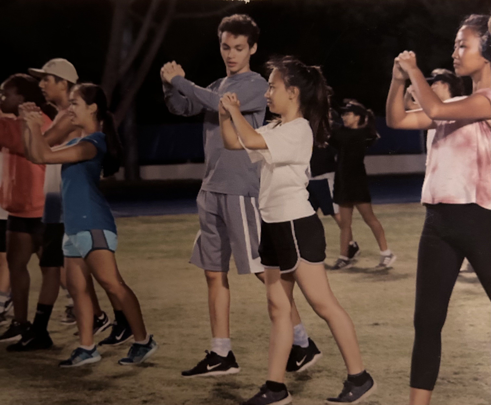
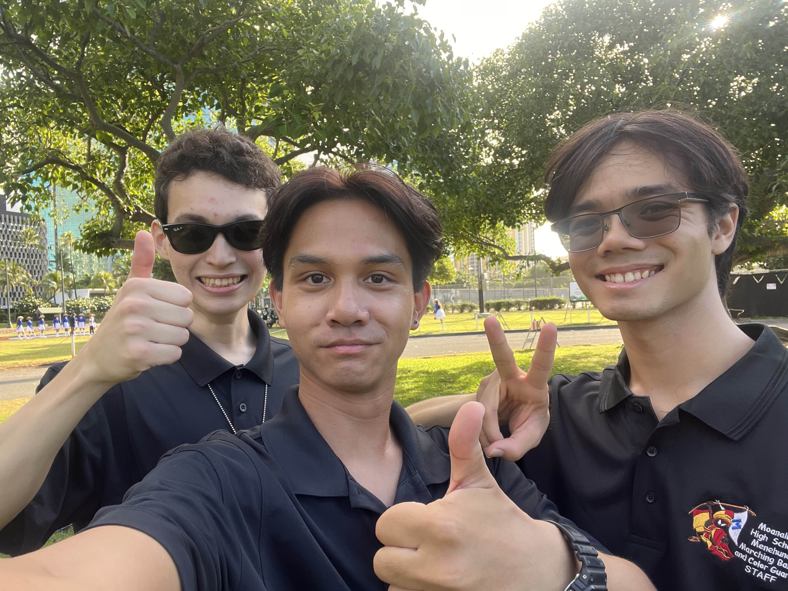

  

The outbreak of COVID-19 was rough. So rough, that I felt like I wanted to make a difference, no mater how small. At the time, I had just graduated from high school and I was studying to become an educator in music. I felt like I had an obligation to give back, as well as hone my music ed skills. So, I decided to help out by becoming a music and field technincian in the marching band program.

On top of helping others be the best they can be (something I thoroughly enjoy and enjoyed doing), I managed to take away a lot from the experience. Being in a educator position trained my communicative and collaborative skills, increased my capacity for empathy, and overall helped me become better and all rounded as a person. I've obviously switched gears from becoming a music educator, and I have since stopped volunteering to focus on school and work. However, I will always be thankful that I made the decision to give back in such a rough time for everyone.
